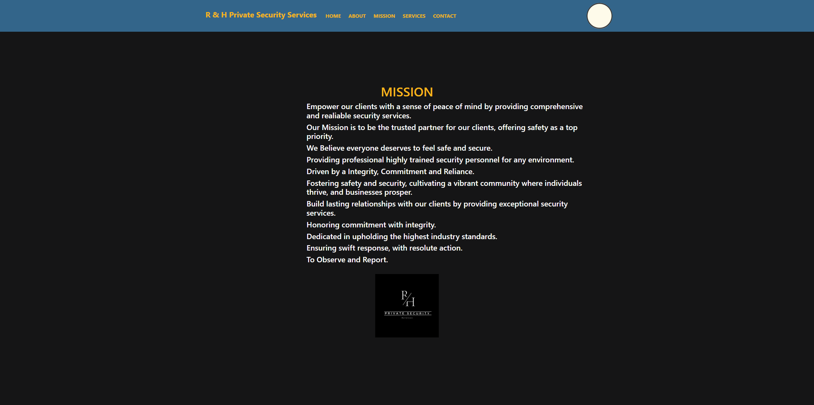

# R & H | Private Security Services

  

## React Web Application

# Description

React Web Application. This project has two features:

1. . Fully Responsive React Application
2. . React Contact Form

# Getting Started with Create React App
## 🛠 Installation
This project was bootstrapped with [Create React App](https://github.com/facebook/create-react-app).

## Available Scripts
In the project directory, you can run:

## Dependencies

- Nodejs - The runtime environment of the application
- Reactjs - Component based UI library
- Emailjs - Send Contact Form Email using Js

### `npm start`

Runs the app in the development mode.\
Open [http://localhost:3000](http://localhost:3000) to view it in your browser.

The page will reload when you make changes.\
You may also see any lint errors in the console.

### `npm test`

Launches the test runner in the interactive watch mode.\
See the section about [running tests](https://facebook.github.io/create-react-app/docs/running-tests) for more information.

### `npm run build`

Builds the app for production to the `build` folder.\
It correctly bundles React in production mode and optimizes the build for the best performance.

The build is minified and the filenames include the hashes.\
Your app is ready to be deployed!

See the section about [deployment](https://facebook.github.io/create-react-app/docs/deployment) for more information.

### `npm run eject`

**Note: this is a one-way operation. Once you `eject`, you can't go back!**

If you aren't satisfied with the build tool and configuration choices, you can `eject` at any time. This command will remove the single build dependency from your project.

Instead, it will copy all the configuration files and the transitive dependencies (webpack, Babel, ESLint, etc) right into your project so you have full control over them. All of the commands except `eject` will still work, but they will point to the copied scripts so you can tweak them. At this point you're on your own.

You don't have to ever use `eject`. The curated feature set is suitable for small and middle deployments, and you shouldn't feel obligated to use this feature. However we understand that this tool wouldn't be useful if you couldn't customize it when you are ready for it.

## Learn More

You can learn more in the [Create React App documentation](https://facebook.github.io/create-react-app/docs/getting-started).

To learn React, check out the [React documentation](https://reactjs.org/).

### Code Splitting

This section has moved here: [https://facebook.github.io/create-react-app/docs/code-splitting](https://facebook.github.io/create-react-app/docs/code-splitting)

### Analyzing the Bundle Size

This section has moved here: [https://facebook.github.io/create-react-app/docs/analyzing-the-bundle-size](https://facebook.github.io/create-react-app/docs/analyzing-the-bundle-size)

### Making a Progressive Web App

This section has moved here: [https://facebook.github.io/create-react-app/docs/making-a-progressive-web-app](https://facebook.github.io/create-react-app/docs/making-a-progressive-web-app)

### Advanced Configuration

This section has moved here: [https://facebook.github.io/create-react-app/docs/advanced-configuration](https://facebook.github.io/create-react-app/docs/advanced-configuration)

### Deployment

This section has moved here: [https://facebook.github.io/create-react-app/docs/deployment](https://facebook.github.io/create-react-app/docs/deployment)

### `npm run build` fails to minify

This section has moved here: [https://facebook.github.io/create-react-app/docs/troubleshooting#npm-run-build-fails-to-minify](https://facebook.github.io/create-react-app/docs/troubleshooting#npm-run-build-fails-to-minify)

### Running

After this you can run the project locally:

- To run the front end
  - <code>cd client</code>
  - <code>npm start</code>
- To run the back end
  - <code>cd server</code>
  - <code>npm run dev</code>
    TIP: Run both in split terminal so that you can see both ends running

# Languages and tools

- [Node](https://nodejs.org)
- [React](https://reactjs.org/)
- [Material UI](https://mui.com/)
- [Bootstrap](https://getbootstrap.com/)
- [React Bootstrap](https://react-bootstrap.netlify.app/) 
 

## Screenshots 

 

## Live:
  Visit R & H Private Security Services [here](https://exactmatchpersonnel.com/ "Link to EMP").
 

## Contribution | Special Thanks ⭐

    NASA | Unsplash Stock Image HD Wallpapers › HD City Wallpapers Los Angeles by Night

Visit [here](https://unsplash.com/photos/aerial-photography-of-city-during-night-time-1lfI7wkGWZ4).
    
    

## License

 

### Show your support

Give a ⭐ if you like this website!

# Portfotlio
My personal portfolio which features some of my Github Projects as well as my Resume and Technical Skills. [💼](https://cdmmandalorian.github.io/AEGcodesPortfolio/ "Link AEGcodes Portfolio").